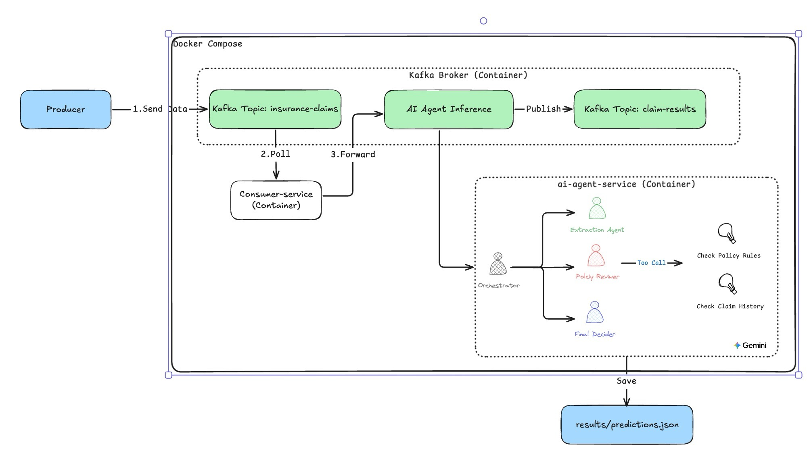
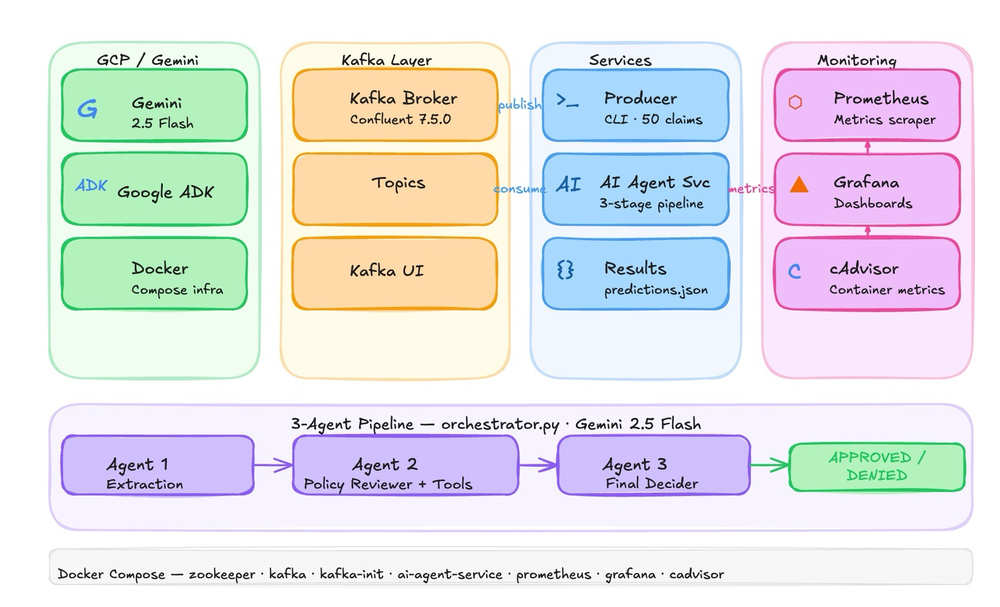

# Multi-Agent Insurance Claim Processor

A proof-of-concept multi-agent system that processes insurance claims through a 3-stage AI pipeline, powered by **Google ADK** and streamed via **Apache Kafka**.

## Architecture



### Kafka Elements

| Element | Value | Role |
|---------|-------|------|
| **Topic** | `insurance-claims` | Raw claims published by the producer ||
| **Topic** | `claim-results` | Final decisions published by ai-agent-service |
| **Consumer Group** | `consumer-service-group` | Subscribes to `insurance-claims`; commits offset after forwarding |
| **Offset reset** | `earliest` | Both consumers replay from the beginning on restart |
| **Partition** | 1 per topic (POC) | Can be scaled to N for parallel processing in production |

## Tech Stack

## Agent Pipeline

```
Diagnosis Text --> [Extraction Agent] --> [Policy Reviewer] --> [Final Decider] --> Verdict
                    Gemini 2.5 Flash     Gemini 2.5 Flash     Gemini 2.5 Flash
                                           + Tool Use
```

| Agent | Role | Tools |
|-------|------|-------|
| Agent 1: Extraction | Extracts surgery type, disease, severity, hospitalization days from free-text diagnosis | None |
| Agent 2: Policy Reviewer | Verifies claim against policy rules and claim history | `check_policy_rules`, `get_claim_history` |
| Agent 3: Final Decider | Issues final verdict based on extraction + review | None |

**Verdicts:** `APPROVED` / `DENIED` / `MANUAL_REVIEW`

## Project Structure

```
poc-kafka-with-ai-agent/
├── docker-compose.yml
├── requirements.txt            # Top-level venv (local dev)
├── .env                        # GOOGLE_API_KEY (gitignored)
├── .env.example
│
├── producer/
│   ├── main.py                 # CLI script: send claims to Kafka
│   └── data/
│       └── sample_claims.json  # 50 simulated insurance claims
│
├── consumer_service/
│   ├── main.py                 # Poll insurance-claims
│   └── Dockerfile
│
├── ai_agent_service/
│   ├── main.py                 # Poll insurance-claims, run LLM pipeline
│   ├── orchestrator.py         # Sequential 3-agent pipeline
│   ├── token_tracker.py        # Token usage tracking via after_model_callback
│   ├── test_local.py           # Local test without Kafka
│   ├── agents/
│   │   ├── extraction.py       # Agent 1
│   │   ├── reviewer.py         # Agent 2 (Tool Use)
│   │   └── decider.py          # Agent 3
│   ├── tools/
│   │   ├── policy_lookup.py    # check_policy_rules()
│   │   └── claim_history.py    # get_claim_history()
│   └── data/
│       ├── policy_db.json      # 9 simulated insurance policies
│       └── claims_history.json # Historical claims per policy
│
├── evaluation/
│   ├── evaluator.py            # GeminiJudge + DeepEval metrics
│   ├── run_evaluation.py       # Main evaluation runner
│   └── README.md               # How to run evaluation
│
└── results/                    # Output (gitignored, created at runtime)
    ├── predictions.json
    ├── token_usage.json
    └── evaluation_report.json
```

## Quick Start

### Prerequisites

- Docker Desktop (running)
- Gemini API key

### 1. Configure environment

```bash
cp .env.example .env
# Edit .env and set your GOOGLE_API_KEY
```

### 2. Install local dependencies

```bash
python3 -m venv .venv
source .venv/bin/activate
pip install -r requirements.txt
```

### 3. Start infrastructure + agent system

```bash
docker compose up -d
```

This starts Kafka + Zookeeper, Kafka UI (`:8080`), `consumer-service`, and `ai-agent-service`.

### 4. Send claims

```bash
# Send all 50 claims (3s interval)
python producer/main.py

# Or control count and speed
python producer/main.py --count 5 --interval 1
```

### 5. Monitor

```bash
docker logs -f consumer-service    # forwarding logs
docker logs -f ai-agent-service    # LLM processing logs

# Results file (updated after each claim)
cat results/predictions.json
```

**Kafka UI**: http://localhost:8080

| Page | What you can see |
|------|-----------------|
| `insurance-claims` topic | Raw claims from producer |
| `claim-results` topic | Agent decisions |
| Consumer groups | `consumer-service-group`, `ai-agent-service-group` |

### 6. Shut down

```bash
docker compose down
```