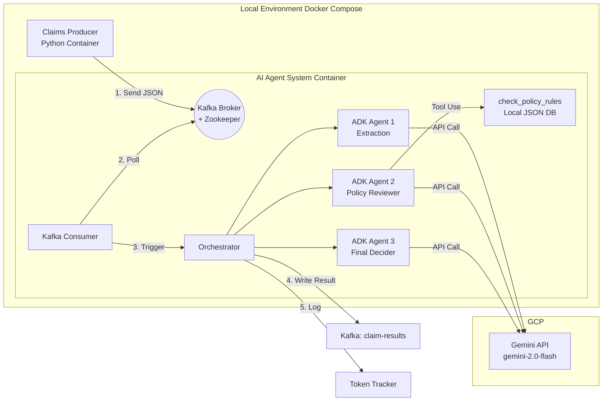

# Implementation Plan: Multi-Agent Insurance Claim System

> **Tech Stack:** Google ADK + Kafka + Docker Compose
> **Runtime:** Local (Docker), Cloud-LLM (Gemini API)

---

## 1. Architecture Overview

### 1.1 System Architecture



---

### Sample Data

**Goal:** Prepare realistic test data for claims and policy database.

**File:** `producer/data/sample_claims.json`

```json
[
  {
    "claim_id": "CLM-001",
    "policy_id": "POL-A100",
    "patient_name": "Wang Xiao-Ming",
    "diagnosis_text": "Patient admitted for acute appendicitis. Underwent laparoscopic appendectomy. Hospitalized for 3 days with uneventful recovery.",
    "claim_amount": 50000,
    "submitted_at": "2025-01-15T10:30:00Z"
  }
]
```


```json
[
  {
    "claim_id": "CLM-001",
    "policy_id": "POL-A100",
    "patient_name": "Wang Xiao-Ming",
    "diagnosis_text": "Patient admitted for acute appendicitis. Underwent laparoscopic appendectomy. Hospitalized for 3 days with uneventful recovery.",
    "claim_amount": 50000,
    "submitted_at": "2025-01-15T10:30:00Z"
  }
]
```

**File:** `producer/data/claims_history.json`
```json
{
  "POL-B200": [
    {
      "claim_id": "CLM-H001",
      "surgery_type": "knee arthroscopy",
      "claim_amount": 10000,
      "approved_amount": 10000,
      "verdict": "APPROVED",
      "submitted_at": "2025-03-10T09:00:00Z"
    }
  ],
  "POL-D400": [
    {
      "claim_id": "CLM-H002",
      "surgery_type": "hernia repair",
      "claim_amount": 30000,
      "approved_amount": 30000,
      "verdict": "APPROVED",
      "submitted_at": "2025-02-20T14:00:00Z"
    }
  ]
}
```

**File:** `agent_system/data/policy_db.json`

```json
{
  "POL-A100": {
    "holder": "Wang Xiao-Ming",
    "plan": "Basic Medical",
    "surgery_coverage": true,
    "max_per_claim": 30000,
    "annual_limit": 200000,
    "exclusions": ["cosmetic surgery", "preventive checkup"],
    "status": "active"
  }
}
```

### Producer

**Goal:** Publish claims to Kafka one by one with interval.

**File:** `producer/main.py`

```python
# Pseudocode
load sample_claims.json
for claim in claims:
    producer.send("insurance-claims", claim)
    log(f"Published {claim['claim_id']}")
    sleep(3)  # simulate real-time ingestion
```

**Deliverables:**

- `producer/main.py` with KafkaProducer
- `producer/Dockerfile` (python:3.11-slim based)
- `producer/requirements.txt`
- Retry logic: wait for Kafka to be ready before sending
