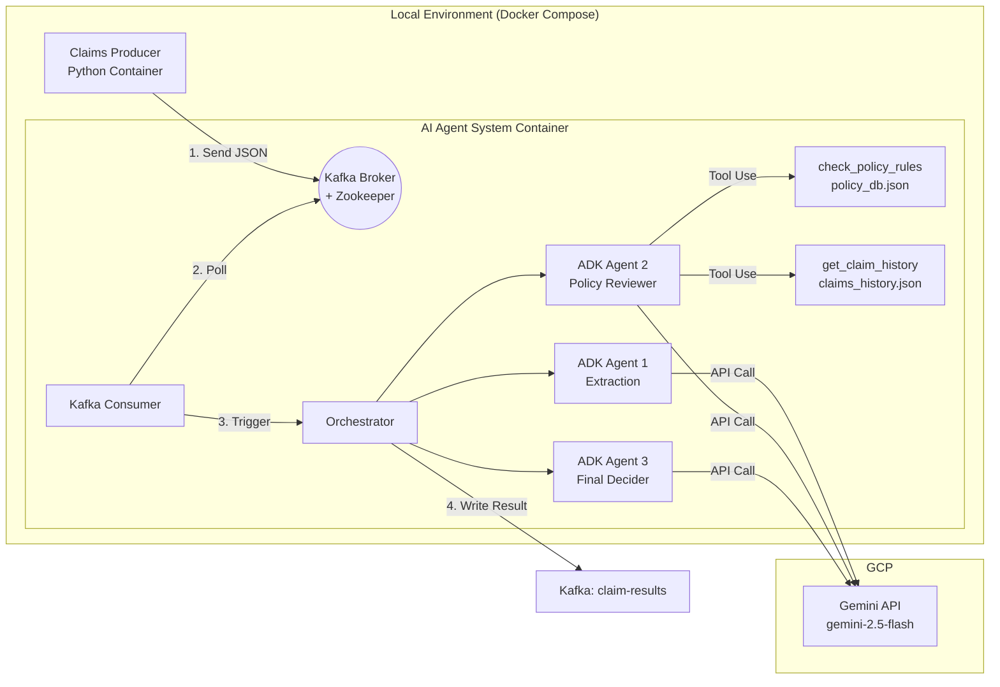

# Multi-Agent Insurance Claim Processor

A proof-of-concept multi-agent system that processes insurance claims through a 3-stage AI pipeline, powered by **Google ADK** and streamed via **Apache Kafka**.

## Architecture



## Agent Pipeline

Each claim flows through 3 agents sequentially:

```
Diagnosis Text --> [Extraction Agent] --> [Policy Reviewer] --> [Final Decider] --> Verdict
                    Gemini 2.5 Flash     Gemini 2.5 Flash     Gemini 2.5 Flash
                                           + Tool Use
```

| Agent | Role | Tools |
|-------|------|-------|
| Agent 1: Extraction | Extracts surgery type, disease, severity, hospitalization days from free-text diagnosis | None |
| Agent 2: Policy Reviewer | Verifies claim against policy rules and claim history | `check_policy_rules`, `get_claim_history` |
| Agent 3: Final Decider | Issues final verdict based on extraction + review | None |

**Verdicts:** `APPROVED` / `DENIED` / `MANUAL_REVIEW`

## Project Structure

```
poc-kafka-with-ai-agent/
├── docker-compose.yml
├── .env                        # GOOGLE_API_KEY (gitignored)
├── .env.example
│
├── producer/
│   ├── Dockerfile
│   ├── requirements.txt
│   ├── main.py                 # Publishes 50 claims to Kafka topic
│   └── data/
│       └── sample_claims.json  # 50 simulated insurance claims
│
├── agent_system/
│   ├── Dockerfile
│   ├── requirements.txt
│   ├── main.py                 # Kafka consumer + result persistence
│   ├── orchestrator.py         # Sequential 3-agent pipeline
│   ├── token_tracker.py        # Token usage tracking via after_model_callback
│   ├── test_local.py           # Local test without Kafka
│   ├── agents/
│   │   ├── extraction.py       # Agent 1
│   │   ├── reviewer.py         # Agent 2 (Tool Use)
│   │   └── decider.py          # Agent 3
│   ├── tools/
│   │   ├── policy_lookup.py    # check_policy_rules()
│   │   └── claim_history.py    # get_claim_history()
│   └── data/
│       ├── policy_db.json      # 9 simulated insurance policies
│       └── claims_history.json # Historical claims per policy
│
└── results/                    # Output directory (Docker volume mount)
    ├── predictions.json
    └── token_usage.json
```

## Quick Start

### Prerequisites

- Docker Desktop (running)
- Gemini API key

### 1. Configure environment

```bash
cp .env.example .env
# Edit .env and set your GOOGLE_API_KEY
```

### 2. Start all services

```bash
docker compose up --build -d
```

### 3. Monitor processing

```bash
docker compose logs -f agent-system
```

### 4. Visual monitoring (Kafka UI)

Once services are up, open **http://localhost:8080** in your browser.

| Page | URL | What you can see |
|------|-----|------------------|
| Topics overview | http://localhost:8080/ui/clusters/local/topics | Message count per topic |
| Incoming claims | http://localhost:8080/ui/clusters/local/topics/insurance-claims/messages | Raw claim JSON as they arrive |
| Agent decisions | http://localhost:8080/ui/clusters/local/topics/claim-results/messages | AI verdicts written by agent system |
| Consumer lag | http://localhost:8080/ui/clusters/local/consumer-groups/agent-system-group | How far behind the consumer is |

### 5. View results

```bash
cat results/predictions.json
cat results/token_usage.json
```

### 6. Shut down

```bash
docker compose down
```

## Local Test (without Docker)

```bash
cd agent_system
python3 -m venv .venv && source .venv/bin/activate
pip install -r requirements.txt
export GOOGLE_API_KEY="your-api-key"
python test_local.py
```

## Re-run

To reprocess all claims, fully reset Kafka state:

```bash
docker compose down
docker compose up --build -d
```
