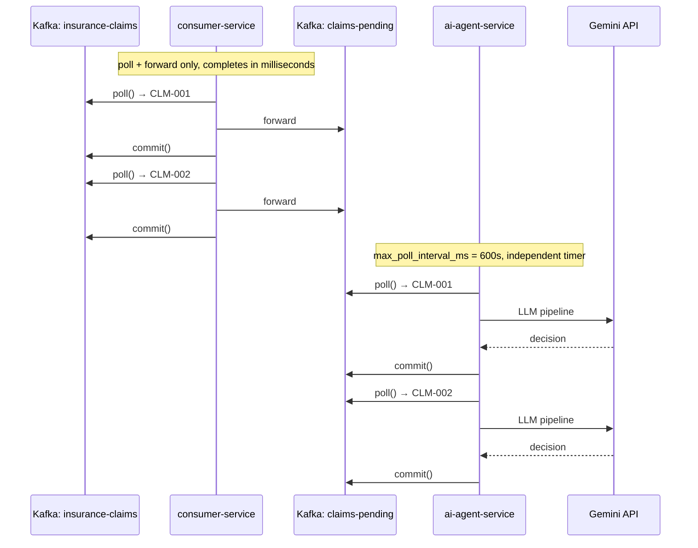

# Architecture & Design: Multi-Agent Insurance Claim System

> **Tech Stack:** Google ADK + Kafka + Docker Compose
> **Runtime:** Local (Docker), Cloud-LLM (Gemini API)

---

## 1. System Architecture

### 1.1 Kafka Message Flow

```
producer/main.py
    │
    ▼
Kafka: insurance-claims
    │
    ▼
consumer-service          ← fast forward only, no LLM
    │
    ▼
Kafka: claims-pending
    │
    ▼
ai-agent-service          ← 3-agent LLM pipeline
    │
    ▼
Kafka: claim-results
```

| Topic | Producer | Consumer | Purpose |
|-------|----------|----------|---------|
| `insurance-claims` | `producer/main.py` | `consumer-service` | Raw claim ingestion |
| `claims-pending` | `consumer-service` | `ai-agent-service` | Decouples fast poll from slow LLM |
| `claim-results` | `ai-agent-service` | downstream services | Final decisions |

- **Serialization**: JSON (UTF-8)
- **Offset reset**: `earliest` — consumer reads from the beginning
- **consumer-service**: `enable_auto_commit=False`, commits after forwarding
- **ai-agent-service**: `max_poll_interval_ms=600000` (10 min) to accommodate LLM processing time

---

## 1.2 Architecture Evolution

### v1 — Single Service (original)

**Problem**: The single service ran poll → LLM → commit in the same loop. Each claim takes ~40s. After several claims the total time exceeded `max_poll_interval_ms` (default 300s), causing Kafka to assume the consumer was dead and trigger a rebalance (`CommitFailedError`).

```mermaid
sequenceDiagram
    participant K as Kafka: insurance-claims
    participant A as agent-system (single service)
    participant L as Gemini API

    Note over K,A: max_poll_interval_ms = 300s (default)

    A->>K: poll() → CLM-001
    A->>L: LLM pipeline
    L-->>A: decision
    A->>K: commit()

    A->>K: poll() → CLM-002
    A->>L: LLM pipeline
    L-->>A: decision
    A->>K: commit()

    A->>K: poll() → CLM-003
    A->>L: LLM pipeline
    L-->>A: decision

    Note over K,A: Cumulative wait > 300s, Kafka assumes consumer is dead

    A->>K: commit() Error : CommitFailedError
    Note over K,A: Consumer kicked from group, rebalance triggered
```



### v2 — Split Services (current)

**Improvement**: `consumer-service` only polls and forwards in milliseconds, never at risk of timeout. `ai-agent-service` has its own independent timer with `max_poll_interval_ms=600s`, well above the ~40s needed per claim.



| | v1 | v2 |
|---|---|---|
| Services | 1 | 2 |
| Topics | 2 | 3 |
| Kafka timeout risk | Yes | No |
| Responsibility | Mixed | Separated |

---

## 2. Tech Stack

| Component       | Technology              | Purpose                             |
|-----------------|-------------------------|-------------------------------------|
| Agent Framework | `google-adk` (v1.26+)  | Multi-agent orchestration, Tool Use |
| LLM             | Gemini 2.5 Flash        | NLU, reasoning, decision            |
| Message Queue   | Apache Kafka            | Decouple ingestion from processing  |
| Container       | Docker Compose          | One-command local deployment        |
| Language        | Python 3.11             | All application code                |
| Auth            | `GOOGLE_API_KEY` env var | No GCP project needed              |

---

## 3. Agent Design

### Agent 1: Extraction

Extracts structured medical features from free-text diagnosis.

```python
class ExtractionResult(BaseModel):
    surgery_type: str
    disease: str
    hospitalization_days: int
    severity: Literal["low", "medium", "high"]
```

### Agent 2: Policy Reviewer (Tool Use)

Verifies claim against policy rules and claim history by calling two tools. ADK handles the function calling loop automatically:

1. Gemini sees the tool declarations
2. Gemini decides to call `check_policy_rules` and `get_claim_history`
3. ADK executes the Python functions locally
4. ADK sends results back to Gemini
5. Gemini generates the final review

```python
class ReviewResult(BaseModel):
    policy_found: bool
    policy_status: str          # active / expired
    is_covered: bool
    is_excluded: bool
    matched_exclusion: str | None
    max_per_claim: int
    claim_amount: int
    amount_within_limit: bool
    annual_remaining: int
    verification_summary: str
```

### Agent 3: Final Decider

Synthesizes extraction + review into a verdict.

```python
class Decision(BaseModel):
    claim_id: str
    verdict: Literal["APPROVED", "DENIED", "MANUAL_REVIEW"]
    reason: str
    approved_amount: float
    flags: list[str]  # e.g. ["over_limit", "excluded_surgery"]
```

**Decision rules:**
- `APPROVED`: policy active + surgery covered + not excluded + within limits
- `DENIED`: expired policy / excluded surgery / no coverage / over limit
- `MANUAL_REVIEW`: edge cases or conflicting signals

---

## 4. Sample Data

### Insurance Claims (`producer/data/sample_claims.json`)

50 claims across 10 patients and 9 policies, covering diverse medical scenarios:

| Claim ID | Patient | Surgery | Amount | Policy | Expected Scenario |
|----------|---------|---------|--------|--------|-------------------|
| CLM-001 | Wang Xiao-Ming | Appendectomy | 50,000 | POL-A100 | Over per-claim limit (30k) |
| CLM-002 | Lin Mei-Ling | Cholecystectomy | 25,000 | POL-B200 | Normal approval |
| CLM-003 | Chen Da-Wei | Rhinoplasty | 80,000 | POL-C300 | Cosmetic surgery exclusion |
| CLM-004 | Zhang Li-Hua | ACL Reconstruction | 120,000 | POL-D400 | Expired policy |
| CLM-005 | Huang Yu-Ting | Emergency PCI | 350,000 | POL-E500 | High severity, premium plan |
| CLM-006 | Wu Jia-Hui | Health Screening | 15,000 | POL-F600 | Preventive checkup exclusion |
| CLM-007 | Liu Zhi-Qiang | Microdiscectomy | 45,000 | POL-G700 | Normal approval |
| CLM-008 | Xu Shu-Fen | ORIF (fracture) | 35,000 | POL-H800 | Normal approval |
| CLM-009 | Yang Jing-Wen | Cataract Surgery | 28,000 | POL-I900 | No surgery coverage |
| CLM-010 | Wang Xiao-Ming | Hernia Repair | 40,000 | POL-A100 | Same patient, over limit |
| CLM-011 ~ CLM-050 | (same 10 patients) | Various | Various | Various | Extended scenarios |

### Insurance Policies (`ai_agent_service/data/policy_db.json`)

9 policies with varying plan tiers, limits, and exclusions:

| Policy | Holder | Plan | Per-Claim Limit | Annual Limit | Status | Key Exclusions |
|--------|--------|------|----------------|--------------|--------|----------------|
| POL-A100 | Wang Xiao-Ming | Basic Medical | 30,000 | 200,000 | active | cosmetic, preventive |
| POL-B200 | Lin Mei-Ling | Standard Medical | 50,000 | 300,000 | active | cosmetic, preventive, dental |
| POL-C300 | Chen Da-Wei | Basic Medical | 40,000 | 200,000 | active | cosmetic, preventive |
| POL-D400 | Zhang Li-Hua | Basic Medical | 60,000 | 250,000 | **expired** | cosmetic, preventive |
| POL-E500 | Huang Yu-Ting | Premium Medical | 500,000 | 1,000,000 | active | cosmetic |
| POL-F600 | Wu Jia-Hui | Standard Medical | 50,000 | 300,000 | active | cosmetic, preventive, dental |
| POL-G700 | Liu Zhi-Qiang | Standard Medical | 50,000 | 300,000 | active | cosmetic, preventive |
| POL-H800 | Xu Shu-Fen | Standard Medical | 50,000 | 300,000 | active | cosmetic, preventive |
| POL-I900 | Yang Jing-Wen | Basic Medical | 20,000 | 150,000 | active | cosmetic, preventive, elective surgery |

> POL-I900 has `surgery_coverage: false` — all surgical claims will be denied regardless of amount.

### Historical Claims (`ai_agent_service/data/claims_history.json`)

Pre-seeded past claims per policy, used by Agent 2 to calculate annual budget consumed:

| Policy | Past Claims | Notable |
|--------|-------------|---------|
| POL-B200 | 1 | knee arthroscopy, APPROVED |
| POL-D400 | 1 | hernia repair, APPROVED |
| POL-E500 | 1 | cardiac catheterization, APPROVED |
| POL-G700 | 2 | gallbladder + colonoscopy, both APPROVED |
| POL-H800 | 3 | includes 1 cosmetic surgery DENIED |

---

## 6. Key Design Decisions

| Decision | Choice | Rationale |
|----------|--------|-----------|
| Agent chaining | Sequential via Orchestrator | Full control over data flow between agents, easier debugging |
| Tool Use | Python functions passed to ADK | ADK auto-handles function calling loop; no manual parsing needed |
| Session management | `InMemorySessionService`, fresh session per agent call | Agents are single-shot; no conversation history needed |
| Output schema | Pydantic models | Enforces structured JSON output from the LLM |
| LLM model | Gemini 2.5 Flash | Fast inference, supports function calling, cost-effective |
| Policy/History data | Local JSON files (no cache) | Simulates DB point-query; cache removed for data freshness |

---

## 5. Token Usage Tracking

Token consumption is tracked via ADK's `after_model_callback` on each agent:

```python
extraction_agent = Agent(
    ...
    after_model_callback=tracker.create_callback("extraction_agent"),
)

def callback(*, callback_context, llm_response):
    usage = llm_response.usage_metadata
    # Records: prompt_tokens, candidates_tokens, thoughts_tokens, total_tokens
```

**Note:** Reviewer agent uses ~2x tokens compared to other agents because it makes 2 LLM calls per claim (tool call + final response). Gemini 2.5 Flash also produces internal chain-of-thought (thoughts tokens) which count toward total usage.
